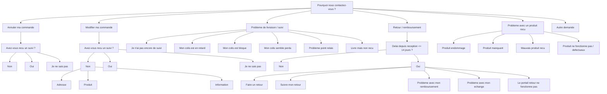

# Form Navigation Tree

Source of truth: `FLOW` in `script.js`.



```text
Pourquoi nous contactez-vous ?
├── Annuler ma commande
│   └── Avez-vous reçu un suivi ?
│       ├── Non
│       │   ├── email
│       │   ├── order_id
│       │   └── action: annulation possible
│       ├── Oui
│       │   └── redirection: Retour / remboursement
│       └── Je ne sais pas
│           ├── email
│           ├── order_id
│           └── action: vérification SAV
├── Modifier ma commande
│   └── Avez-vous reçu un suivi ?
│       ├── Non
│       │   └── Que souhaitez-vous modifier ?
│       │       ├── Adresse
│       │       │   ├── email
│       │       │   ├── order_id
│       │       │   └── message
│       │       ├── Produit
│       │       │   ├── email
│       │       │   ├── order_id
│       │       │   └── message
│       │       └── Information
│       │           ├── email
│       │           ├── order_id
│       │           └── message
│       ├── Oui
│       │   └── redirection: Retour / remboursement
│       └── Je ne sais pas
│           ├── email
│           ├── order_id
│           └── message
├── Problème de livraison / suivi
│   └── Quel est votre problème ?
│       ├── Je n’ai pas encore de suivi
│       │   ├── email
│       │   └── order_id
│       ├── Mon colis est en retard
│       │   ├── email
│       │   ├── order_id
│       │   ├── tracking_number optionnel
│       │   └── message optionnel
│       ├── Mon colis est bloqué
│       │   ├── email
│       │   ├── order_id
│       │   ├── tracking_number optionnel
│       │   └── message optionnel
│       ├── Mon colis semble perdu
│       │   ├── email
│       │   ├── order_id
│       │   ├── tracking_number optionnel
│       │   └── message optionnel
│       ├── Problème point relais
│       │   ├── email
│       │   ├── order_id
│       │   ├── tracking_number optionnel
│       │   └── message
│       └── Livré mais non reçu
│           ├── email
│           ├── order_id
│           ├── tracking_number optionnel
│           └── message obligatoire
├── Retour / remboursement
│   └── Délai depuis réception ≤ 14 jours ?
│       ├── Non
│       │   ├── email
│       │   ├── message
│       │   └── action: traitement manuel SAV
│       └── Oui
│           └── Que souhaitez-vous faire ?
│               ├── Faire un retour
│               │   ├── email
│               │   └── order_id
│               ├── Suivre mon retour
│               │   ├── email
│               │   └── returngo_id
│               ├── Problème avec mon remboursement
│               │   ├── email
│               │   ├── returngo_id
│               │   └── message
│               ├── Problème avec mon échange
│               │   ├── email
│               │   ├── order_id
│               │   └── message
│               └── Le portail retour ne fonctionne pas
│                   ├── email
│                   ├── order_id
│                   └── message
├── Problème avec un produit reçu
│   └── Quel est le problème ?
│       ├── Produit endommagé
│       │   ├── email
│       │   ├── order_id
│       │   ├── photo obligatoire
│       │   └── message
│       ├── Produit manquant
│       │   ├── email
│       │   ├── order_id
│       │   ├── photo optionnel
│       │   └── message
│       ├── Mauvais produit reçu
│       │   ├── email
│       │   ├── order_id
│       │   ├── photo obligatoire
│       │   └── message
│       └── Produit ne fonctionne pas / défectueux
│           ├── email
│           ├── order_id
│           ├── photo optionnel
│           └── message
└── Autre demande
    ├── email
    ├── order_id optionnel
    └── message
```

## Totals

- Top-level categories: 6
- Leaf outcomes: 24
- Ticket forms: 22
- Redirection branches: 2
